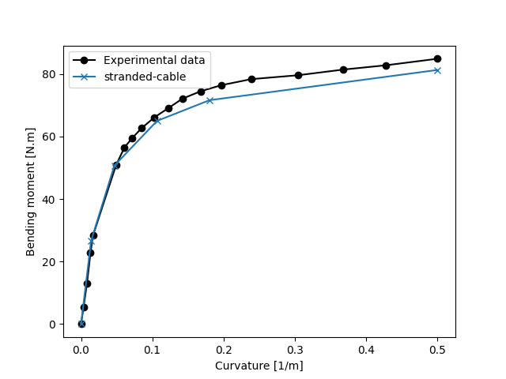
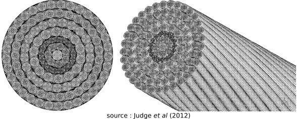
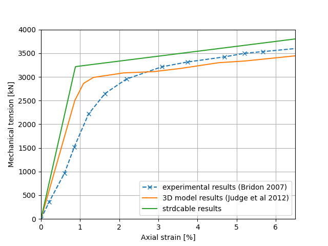

Dataset creation
================
This example can be reproduced by executing the script called 'example_dataset_creation.py' located in the examples folder.
It uses a small dataset of conductor definitions located in strdcable/data/ to build a complete dataset, including
homogenized physical properties, for all conductors of the dataset, as well as properties for each layer.

The script imports class TablesOHLconductors which handles the calculation of properties and the creation of the dataframes.

.. code-block:: python

    import pandas as pd
    from strdcable.overheadlines import TablesOHLconductors
    from strdcable.config import cfg, __PATH_STRDCABLE__  # paths to datafiles stored in /strdcable/data/

    path = __PATH_STRDCABLE__ + '/'

With a given path to a csv file containing conductor definition data, a pandas Dataframe can be created from reading the raw csv file.
Then, this dataframe is the only argument needed to instantiate the TablesOHLconductor class:

.. code-block:: python

    # path to csv containing data for cables
    cables_table_path = path + cfg['example_files']['cables_dataset']
    # dataframe obtained from the csv dataset
    df_cabledata = pd.read_csv(cables_table_path)

    # creating a table object with properties for all selected cables
    cables_table = TablesOHLconductors(df_cabledata)

The create_dataset method handles the creation of the dataframe for the complete conductors as well as the dataframe for all layers.
These two dataframes can be retrieved from the TablesOHLconductors object:

.. code-block:: python

    # creating the dataset in the table object
    cables_table.create_dataset()
    # obtaining cable data
    cables_dataframe = cables_table.dfconductors
    # obtaining layer data
    layers_dataframe = cables_table.dflayers

Here are a selection of columns in the obtained datasets:

.. code-block:: text

    >>> cables_dataframe[['cable', 'bimaterial', 'lineic_mass', 'rated_strength', 'rugosity']]
        cable  bimaterial  lineic_mass  rated_strength  rugosity
    0   ASTER570       False     1.570673   185328.097510  0.062500
    1   CARDINAL        True     1.770510   175263.409720  0.062359
    2  CROCUS412        True     1.573314   193939.310966  0.078947

    >>> layers_dataframe[['cable', 'layer', 'nature', 'dwires', 'ultimate_stress']].sort_values(by=['cable', 'layer'])
            cable  layer   nature   dwires  ultimate_stress
    0    ASTER570      1  ALMELEC  0.00345        325000000
    1    ASTER570      2  ALMELEC  0.00345        325000000
    2    ASTER570      3  ALMELEC  0.00345        325000000
    3    ASTER570      4  ALMELEC  0.00345        325000000
    4    ASTER570      5  ALMELEC  0.00345        325000000
    5    CARDINAL      1    ACIER  0.00334       1600000000
    6    CARDINAL      2    ACIER  0.00334       1600000000
    7    CARDINAL      3      ALU  0.00332        165000000
    8    CARDINAL      4      ALU  0.00332        165000000
    9    CARDINAL      5      ALU  0.00332        165000000
    10  CROCUS412      1    ACIER  0.00240       1650000000
    11  CROCUS412      2    ACIER  0.00240       1650000000
    12  CROCUS412      3    ACIER  0.00240       1650000000
    13  CROCUS412      4      ALU  0.00360        160000000
    14  CROCUS412      5      ALU  0.00360        160000000

Bending test
============
This example can be reproduced by executing the script called 'example_conductor_bending.py' located in the /examples/ folder.
It isolates the Cardinal conductor from the small dataset of conductors provided with the package and calculates the bending moment
of the cable as a function of the curvature of the cable, using the calculated bending stiffness and comparing to experimental data
reported by Foti for the Cardinal cable (https://doi.org/10.1016/j.jweia.2018.09.005).

The bending test uses 40 kN of mechanical tension. Results obtained from the stranded-cable package are plotted in blue with
the reference from experimental data plotted in black.

Traction test
===========================
This example can be reproduced by executing the script called 'example_cable_traction.py' located in the /examples/ folder.
It takes as an input the 120-wire spiral strand cable defined by Judge et al in their article (http://dx.doi.org/10.1016/j.conbuildmat.2011.12.073).

The traction test uses the axial strains given by Judge et al. Results obtained from the stranded-cable package are plotted in green with
the reference from experimental data plotted in blue and from 3D finite elements model plotted in orange.

